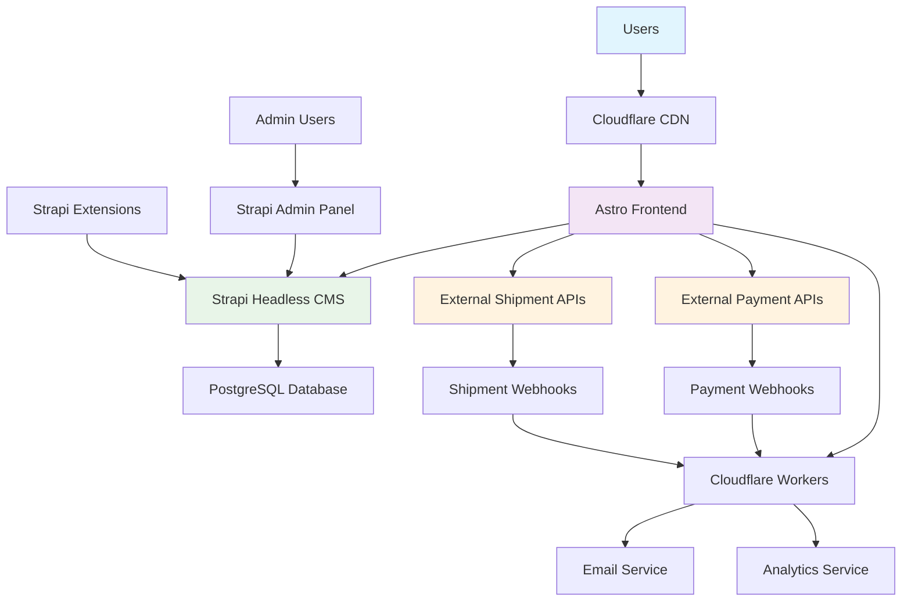

# Single-Seller Ecommerce Platform Fullstack Architecture Document

*Generated on: [Current Date]*

---

## Introduction

This document outlines the complete fullstack architecture for the Single-Seller Ecommerce Platform, including backend systems, frontend implementation, and their integration. It serves as the single source of truth for AI-driven development, ensuring consistency across the entire technology stack.

This unified approach combines what would traditionally be separate backend and frontend architecture documents, streamlining the development process for modern fullstack applications where these concerns are increasingly intertwined.

### Starter Template or Existing Project

**N/A - Greenfield project**

This is a greenfield project built on Strapi's headless CMS architecture. The project leverages Strapi's existing content management capabilities and extends them with custom ecommerce functionality.

### Change Log

| Date | Version | Description | Author |
|------|---------|-------------|---------|
| [Current Date] | v1.0 | Initial architecture document creation | Winston (Architect) |

---

## High Level Architecture

### Technical Summary

The Single-Seller Ecommerce Platform follows a **Strapi-based headless architecture** with an **Astro frontend** optimized for Cloudflare Pages deployment. The system uses Strapi's robust content management capabilities for products, orders, and user management, while the Astro frontend leverages static site generation and partial hydration for optimal performance. Key integration points include Strapi's RESTful APIs for content delivery, external payment APIs (skeleton integration), and external shipment APIs (skeleton integration). The infrastructure uses Cloudflare Pages for frontend deployment with Strapi hosted on a managed platform.

### Platform and Infrastructure Choice

**Platform:** Strapi + Cloudflare Pages
**Key Services:** Strapi Cloud (Backend), Cloudflare Pages (Frontend), External Payment APIs, External Shipment APIs, PostgreSQL (Database)
**Deployment Host and Regions:** Strapi Cloud (Global), Cloudflare Edge Network (Global)

### Repository Structure

**Structure:** Monorepo
**Monorepo Tool:** Nx
**Package Organization:** Apps (frontend, strapi-extensions) + Packages (shared, ui, config)

### High Level Architecture Diagram

### Architectural Patterns

- **Strapi Headless CMS:** Content-first architecture with flexible API delivery - _Rationale:_ Leverages Strapi's proven ecommerce capabilities and admin interface
- **Astro Static-First:** Content-focused frontend with partial hydration - _Rationale:_ Optimal performance for ecommerce with minimal JavaScript
- **External API Integration:** Skeleton integration for payment and shipment services - _Rationale:_ Leverages specialized services without vendor lock-in
- **Component-Based UI:** Reusable components with framework flexibility - _Rationale:_ Can use React, Vue, or Svelte components as needed
- **API-First Design:** Strapi REST APIs as the single source of truth - _Rationale:_ Enables multiple frontend channels and third-party integrations
- **Edge Computing:** Cloudflare Workers for dynamic functionality - _Rationale:_ Global performance and reduced latency
