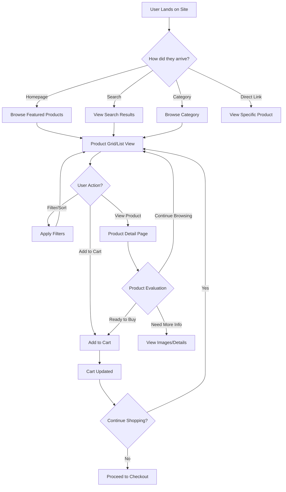
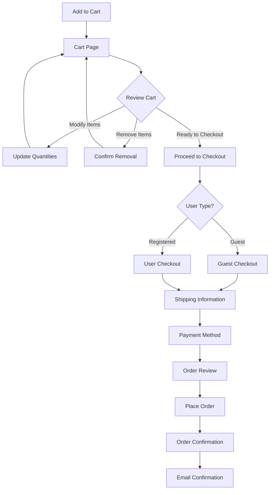

# Single-Seller Ecommerce Platform UI/UX Specification

*Generated on: [Current Date]*

---

## Introduction

This document defines the user experience goals, information architecture, user flows, and visual design specifications for the Single-Seller Ecommerce Platform's user interface. It serves as the foundation for visual design and frontend development, ensuring a cohesive and user-centered experience that eliminates marketplace fees while providing essential ecommerce functionality and minimal company profile pages (About and Contact).

### Overall UX Goals & Principles

#### Target User Personas

- **Small to Medium Business Sellers:** 1-50 employees, $50K-$2M revenue, currently on high-fee platforms
- **Individual Entrepreneurs:** Solo sellers looking to maximize profits and reduce platform dependency
- **Tech-Savvy Sellers:** Users comfortable managing their own product listings and basic ecommerce operations

#### Usability Goals

- **Conversion Focus:** Achieve 3%+ conversion rate from visitors to customers
- **Efficiency:** Keep cart abandonment below 70%
- **Trust Building:** Achieve 4.5+ star customer satisfaction rating
- **Accessibility:** Support sellers with varying technical expertise
- **Mobile-First:** Optimize for mobile users (touch-friendly, responsive design)

#### Design Principles

1. **Sales-First Design** - Every element should support the primary goal of converting visitors to customers
2. **Simplicity Over Complexity** - Streamlined interface that reduces cognitive load and decision fatigue
3. **Trust Through Transparency** - Clear pricing, policies, and company information to build confidence
4. **Mobile-Optimized** - Touch-friendly design that works seamlessly across all devices
5. **Progressive Disclosure** - Show essential information first, with additional details available on demand

### Change Log

| Date | Version | Description | Author |
|------|---------|-------------|---------|
| [Current Date] | v1.0 | Initial UI/UX specification creation | UX Expert |

---

## Information Architecture (IA)

### Site Map / Screen Inventory

```mermaid
graph TD
    A[Homepage] --> B[Product Catalog]
    A --> C[Shopping Cart]
    A --> D[Checkout]
    A --> E[User Account]
    A --> F[Company Profile]
    A --> G[Customer Support]
    
    B --> B1[Product Categories]
    B --> B2[Product Search]
    B --> B3[Product Details]
    B --> B4[Product Filtering]
    
    C --> C1[Cart Review]
    C --> C2[Quantity Updates]
    C --> C3[Cart Summary]
    
    D --> D1[Guest Checkout]
    D --> D2[User Checkout]
    D --> D3[Payment Processing]
    D --> D4[Order Confirmation]
    
    E --> E1[User Registration]
    E --> E2[User Login]
    E --> E3[Profile Management]
    E --> E4[Order History]
    E --> E5[Saved Addresses]
    E --> E6[Payment Methods]
    
    F --> F1[About Page]
    F --> F2[Contact Page]
    F --> F3[Company Policies]
    F --> F4[Privacy Policy]
    
    G --> G1[Contact Form]
    G --> G2[FAQ]
    G --> G3[Support Tickets]
    G --> G4[Help Documentation]
```

### Navigation Structure

**Primary Navigation:**
- **Products** - Main product catalog with categories and search
- **About** - Company information and trust-building content
- **Contact** - Multiple contact methods and support access
- **Account** - User registration, login, and profile management
- **Cart** - Shopping cart with item count indicator

**Secondary Navigation:**
- **Product Categories** - Breadcrumb-style category navigation
- **Search & Filters** - Advanced product discovery tools
- **User Menu** - Account-specific options (orders, settings, logout)
- **Footer Links** - Legal pages, policies, and additional resources

**Breadcrumb Strategy:**
- **Product Pages:** Home > Category > Subcategory > Product Name
- **Account Pages:** Home > Account > [Section Name]
- **Support Pages:** Home > Contact > [Specific Contact Method]
- **Always show current page and provide clear path back to home**

---

## User Flows

### Flow 1: Product Discovery & Browsing

**User Goal:** Find and evaluate products to make a purchase decision

**Entry Points:**
- Homepage product showcase
- Category navigation
- Search functionality
- Product recommendations
- Direct product links

**Success Criteria:**
- User can quickly find relevant products
- Product information is clear and complete
- User can easily add items to cart
- User feels confident about product quality and company trustworthiness

**Flow Diagram:**

**Edge Cases & Error Handling:**
- **No Search Results:** Show "no results found" with suggestions and popular products
- **Out of Stock:** Clear indication with "notify when available" option
- **Slow Loading:** Skeleton screens and progressive loading for product images
- **Filter Conflicts:** Clear feedback when filters return no results
- **Mobile Navigation:** Collapsible filters and touch-friendly product cards

**Notes:** This flow prioritizes product discovery while maintaining clear paths to purchase. The design should minimize friction between browsing and buying.

### Flow 2: Shopping Cart & Checkout

**User Goal:** Complete purchase with minimal friction and maximum confidence

**Entry Points:**
- Add to cart from product pages
- Direct cart access from navigation
- Saved cart from previous session

**Success Criteria:**
- User can easily review and modify cart contents
- Checkout process is streamlined and secure
- User feels confident about payment security
- Order confirmation is clear and actionable

**Flow Diagram:**

**Edge Cases & Error Handling:**
- **Cart Expiration:** Clear messaging about cart timeout and recovery options
- **Payment Failures:** Helpful error messages with alternative payment options
- **Address Validation:** Real-time validation with helpful suggestions
- **Inventory Changes:** Clear messaging if items become unavailable during checkout
- **Session Timeout:** Graceful handling with cart preservation where possible

---

## Wireframes & Mockups

### Design Tool Strategy

**Primary Design Files:** Figma (recommended for collaborative design and developer handoff)

### Key Screen Layouts

#### 1. Homepage Layout
**Purpose:** Product showcase and company trust-building
**Key Elements:**
- Hero section with featured products or value proposition
- Product category navigation
- Featured products grid
- Trust indicators (reviews, policies, company info)
- Clear call-to-action buttons
- Mobile-responsive navigation

**Interaction Notes:**
- Hero section should immediately communicate the value proposition
- Product grid should be easily scannable
- Trust indicators should be visible but not overwhelming
- Navigation should be intuitive for both new and returning users

#### 2. Product Catalog/Listing Page
**Purpose:** Efficient product discovery and comparison
**Key Elements:**
- Filter and sort controls
- Product grid with key information (image, title, price, rating)
- Quick add-to-cart functionality
- Pagination or infinite scroll
- Breadcrumb navigation
- Search bar with suggestions

**Interaction Notes:**
- Filters should be easily accessible but not overwhelming
- Product cards should show enough info for initial evaluation
- Quick add-to-cart should provide immediate feedback
- Mobile layout should stack filters and optimize for touch

#### 3. Product Detail Page
**Purpose:** Comprehensive product information and purchase decision
**Key Elements:**
- Product image gallery with zoom functionality
- Product title, price, and availability
- Add to cart button with quantity selector
- Product description and specifications
- Customer reviews and ratings
- Related products
- Trust indicators (shipping, returns, security)

**Interaction Notes:**
- Image gallery should be touch-friendly on mobile
- Add to cart should be prominently placed and sticky on scroll
- Reviews should be easily accessible but not overwhelming
- Related products should encourage continued shopping

#### 4. Shopping Cart Page
**Purpose:** Review items and proceed to checkout
**Key Elements:**
- Cart item list with images, titles, prices, quantities
- Quantity adjustment controls
- Remove item functionality
- Cart subtotal, tax, and total
- Promo code entry
- Proceed to checkout button
- Continue shopping link

**Interaction Notes:**
- Quantity changes should update totals immediately
- Remove items should require confirmation
- Checkout button should be prominent and clear
- Mobile layout should optimize for easy quantity adjustment

#### 5. Checkout Flow
**Purpose:** Complete purchase with minimal friction
**Key Elements:**
- Guest checkout option
- User registration/login (if not guest)
- Shipping address form
- Payment method selection
- Order summary
- Security indicators
- Terms and conditions acceptance

**Interaction Notes:**
- Guest checkout should be the default option
- Form validation should be real-time and helpful
- Payment methods should be clearly presented
- Security indicators should build trust
- Mobile forms should be optimized for touch input

---

## Component Library / Design System

### Design System Approach

**Recommended:** Create a custom design system based on modern ecommerce patterns with accessibility-first principles.

### Core Components

#### 1. Product Card
**Purpose:** Display product information in catalog and search results
**Variants:** Grid view, list view, featured, related
**States:** Default, hover, loading, out of stock, on sale
**Usage Guidelines:** Consistent spacing, clear hierarchy, touch-friendly targets

#### 2. Add to Cart Button
**Purpose:** Primary action for product purchase
**Variants:** Primary, secondary, quick add, with quantity
**States:** Default, hover, loading, added, disabled
**Usage Guidelines:** Prominent placement, clear feedback, accessible labels

#### 3. Navigation Menu
**Purpose:** Site-wide navigation and user account access
**Variants:** Desktop, mobile, breadcrumb, footer
**States:** Default, hover, active, expanded, collapsed
**Usage Guidelines:** Consistent placement, clear hierarchy, mobile-friendly

#### 4. Form Components
**Purpose:** Data input for checkout, search, and account management
**Variants:** Text input, select, checkbox, radio, textarea
**States:** Default, focus, error, success, disabled
**Usage Guidelines:** Clear labels, helpful validation, accessible error messages

#### 5. Modal/Dialog
**Purpose:** Overlay content for quick actions and confirmations
**Variants:** Product quick view, cart preview, confirmation, form
**States:** Open, closing, loading
**Usage Guidelines:** Clear close options, focus management, backdrop dismissal

---

## Branding & Style Guide

### Visual Identity

**Brand Guidelines:** To be defined based on company branding requirements

### Color Palette

| Color Type | Hex Code | Usage |
|------------|----------|-------|
| Primary | #8B2E3C | Main brand color (deep maroon from logo), primary buttons, links |
| Secondary | #A0522D | Secondary brand color (brick red variation), accents, highlights |
| Accent | #D2691E | Call-to-action highlights, notifications, interactive elements |
| Success | #228B22 | Positive feedback, confirmations, success states |
| Warning | #FF8C00 | Cautions, important notices, warnings |
| Error | #DC143C | Errors, destructive actions, critical alerts |
| Neutral | #F5F5F5, #E0E0E0, #696969 | Text, borders, backgrounds (light gray tones) |

### Typography

#### Font Families
- **Primary:** Inter (clean, modern, highly readable)
- **Secondary:** System fonts (fallback)
- **Monospace:** JetBrains Mono (for code elements if needed)

#### Type Scale

| Element | Size | Weight | Line Height |
|---------|------|--------|-------------|
| H1 | 2.5rem | 700 | 1.2 |
| H2 | 2rem | 600 | 1.3 |
| H3 | 1.5rem | 600 | 1.4 |
| Body | 1rem | 400 | 1.6 |
| Small | 0.875rem | 400 | 1.5 |

### Iconography

**Icon Library:** Lucide React (modern, consistent, accessible)
**Usage Guidelines:** Consistent sizing (16px, 20px, 24px), semantic meaning, accessible labels

### Spacing & Layout

**Grid System:** 12-column responsive grid with 24px base unit
**Spacing Scale:** 4px, 8px, 12px, 16px, 24px, 32px, 48px, 64px

---

## Accessibility Requirements

### Compliance Target

**Standard:** WCAG 2.1 AA compliance

### Key Requirements

**Visual:**
- Color contrast ratios: 4.5:1 for normal text, 3:1 for large text
- Focus indicators: Clear, visible focus states for all interactive elements
- Text sizing: Minimum 16px for body text, scalable up to 200%

**Interaction:**
- Keyboard navigation: Full keyboard accessibility for all functionality
- Screen reader support: Semantic HTML, ARIA labels, proper heading structure
- Touch targets: Minimum 44px for touch targets on mobile

**Content:**
- Alternative text: Descriptive alt text for all images
- Heading structure: Logical heading hierarchy (H1-H6)
- Form labels: Clear, associated labels for all form inputs

### Testing Strategy

- Automated testing with axe-core
- Manual testing with screen readers (NVDA, VoiceOver)
- Keyboard-only navigation testing
- Color contrast validation
- Mobile accessibility testing

---

## Responsiveness Strategy

### Breakpoints

| Breakpoint | Min Width | Max Width | Target Devices |
|------------|-----------|-----------|----------------|
| Mobile | 320px | 767px | Smartphones, small tablets |
| Tablet | 768px | 1023px | Tablets, small laptops |
| Desktop | 1024px | 1439px | Laptops, desktop computers |
| Wide | 1440px | - | Large monitors, high-resolution displays |

### Adaptation Patterns

**Layout Changes:**
- Mobile: Single column layout, stacked navigation
- Tablet: Two-column layout where appropriate
- Desktop: Multi-column layouts, sidebar navigation
- Wide: Optimized for larger screens with increased content density

**Navigation Changes:**
- Mobile: Hamburger menu, bottom navigation for key actions
- Tablet: Collapsible navigation with touch-friendly targets
- Desktop: Horizontal navigation with dropdown menus
- Wide: Full navigation with additional features

**Content Priority:**
- Mobile: Essential content first, progressive disclosure
- Tablet: Balanced content hierarchy
- Desktop: Full content with enhanced features
- Wide: Enhanced content with additional context

**Interaction Changes:**
- Mobile: Touch-optimized interactions, larger touch targets
- Tablet: Touch and mouse support
- Desktop: Mouse and keyboard optimized
- Wide: Enhanced interactions with additional shortcuts

---

## Animation & Micro-interactions

### Motion Principles

- **Purposeful:** Every animation serves a functional purpose
- **Subtle:** Animations enhance rather than distract
- **Consistent:** Standardized timing and easing across the platform
- **Accessible:** Respect user motion preferences and reduce motion when needed

### Key Animations

- **Page Transitions:** Smooth fade transitions between pages (Duration: 300ms, Easing: ease-in-out)
- **Loading States:** Skeleton screens and progress indicators (Duration: 1000ms, Easing: ease-out)
- **Form Feedback:** Success/error state animations (Duration: 200ms, Easing: ease-out)
- **Cart Updates:** Subtle bounce animation for cart additions (Duration: 150ms, Easing: ease-out)
- **Modal Open/Close:** Fade and scale animations (Duration: 250ms, Easing: ease-out)

---

## Performance Considerations

### Performance Goals

- **Page Load:** Under 3 seconds for initial page load
- **Interaction Response:** Under 100ms for user interactions
- **Animation FPS:** 60fps for smooth animations

### Design Strategies

- **Progressive Loading:** Load critical content first, enhance progressively
- **Image Optimization:** WebP format with fallbacks, lazy loading
- **Component Lazy Loading:** Load non-critical components on demand
- **Caching Strategy:** Effective browser and CDN caching
- **Minimal Dependencies:** Reduce third-party script impact

---

## Next Steps

### Immediate Actions

1. **Stakeholder Review:** Present this specification to key stakeholders for feedback
2. **Design Tool Setup:** Create Figma project with component library structure
3. **Visual Design Creation:** Begin creating high-fidelity mockups for key screens
4. **User Testing Plan:** Develop testing strategy for validation
5. **Developer Handoff Preparation:** Prepare specifications for frontend development

### Design Handoff Checklist

- [ ] All user flows documented
- [ ] Component inventory complete
- [ ] Accessibility requirements defined
- [ ] Responsive strategy clear
- [ ] Brand guidelines incorporated
- [ ] Performance goals established

---

## Checklist Results

*This section will be populated when the UI/UX checklist is run against this document.*

---

*Document prepared by UX Expert for Single-Seller Ecommerce Platform*
