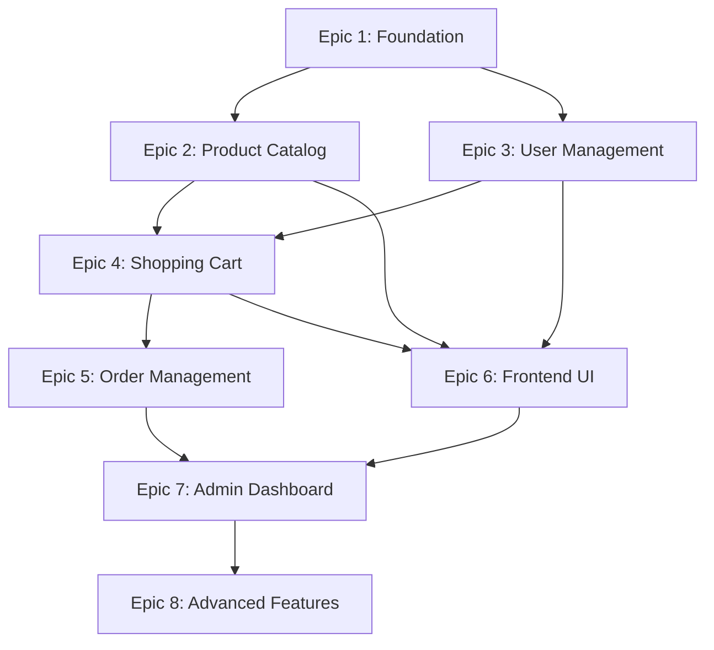

# Ecommerce Platform Epic Overview

## Project Summary
This document provides an overview of the 8 epics that comprise the complete ecommerce platform development. Each epic represents a major functional area that delivers significant value and builds upon previous epics.

## Epic Structure

### Epic 1: Project Foundation & Core Infrastructure ✅ IN PROGRESS
**Status:** 1/4 stories completed
**Goal:** Establish solid technical foundation with Strapi backend, database setup, and core content types
**Key Deliverables:**
- Strapi project initialization with TypeScript
- PostgreSQL database configuration
- Core content types (Product, Category, User, Media)
- API configuration and security setup
- Development environment and tooling

**Current Progress:**
- ✅ Story 1.1: Project Foundation Setup (Completed)
- 🔄 Story 1.2: Core Content Types and Data Models Setup (In Progress)
- ⏳ Story 1.3: API Configuration and Security Setup (Not Started)
- ⏳ Story 1.4: Development Environment and Tooling (Not Started)

### Epic 2: Product Catalog Management ⏳ NOT STARTED
**Status:** 0/6 stories completed
**Goal:** Implement comprehensive product catalog functionality
**Key Deliverables:**
- Product management system
- Category management with hierarchy
- Inventory management system
- Product search and filtering
- Product media management
- Product variants and options

### Epic 3: User Management & Authentication ⏳ NOT STARTED
**Status:** 0/6 stories completed
**Goal:** Implement user management and authentication system
**Key Deliverables:**
- User registration and authentication
- User profile management
- Address management system
- User roles and permissions
- User preferences and settings
- User analytics and activity tracking

### Epic 4: Shopping Cart & Checkout System ⏳ NOT STARTED
**Status:** 0/6 stories completed
**Goal:** Implement complete shopping cart and checkout functionality
**Key Deliverables:**
- Shopping cart management
- Checkout process implementation
- Payment processing integration
- Order creation and management
- Tax and shipping calculation
- Order confirmation and notifications

### Epic 5: Order Management & Fulfillment ⏳ NOT STARTED
**Status:** 0/6 stories completed
**Goal:** Implement order management and fulfillment system
**Key Deliverables:**
- Order processing workflow
- Fulfillment management system
- Order tracking and updates
- Customer service and support
- Order analytics and reporting
- Returns and refunds management

### Epic 6: Frontend User Interface ⏳ NOT STARTED
**Status:** 0/6 stories completed
**Goal:** Develop customer-facing frontend interface
**Key Deliverables:**
- Product catalog frontend
- Shopping cart frontend
- Checkout process frontend
- User account frontend
- Responsive design and mobile optimization
- Performance optimization and SEO

### Epic 7: Admin Dashboard & Management ⏳ NOT STARTED
**Status:** 0/6 stories completed
**Goal:** Develop comprehensive admin dashboard
**Key Deliverables:**
- Product management dashboard
- Order management dashboard
- Customer management dashboard
- Analytics and reporting dashboard
- System administration dashboard
- Content management dashboard

### Epic 8: Advanced Features & Optimization ⏳ NOT STARTED
**Status:** 0/6 stories completed
**Goal:** Implement advanced features and optimizations
**Key Deliverables:**
- Performance optimization and caching
- Advanced ecommerce features
- Security enhancements and compliance
- Monitoring, logging, and analytics
- Scalability and infrastructure optimization
- Advanced marketing and SEO features

## Epic Dependencies

## Development Timeline

### Phase 1: Foundation (Epic 1)
- **Duration:** 2-3 weeks
- **Focus:** Backend infrastructure and core data models
- **Status:** In Progress

### Phase 2: Core Ecommerce (Epics 2-4)
- **Duration:** 6-8 weeks
- **Focus:** Product catalog, user management, and shopping functionality
- **Status:** Not Started

### Phase 3: Order Management (Epic 5)
- **Duration:** 3-4 weeks
- **Focus:** Order processing and fulfillment
- **Status:** Not Started

### Phase 4: User Interfaces (Epics 6-7)
- **Duration:** 6-8 weeks
- **Focus:** Customer frontend and admin dashboard
- **Status:** Not Started

### Phase 5: Optimization (Epic 8)
- **Duration:** 4-5 weeks
- **Focus:** Performance, security, and advanced features
- **Status:** Not Started

## Total Project Scope
- **8 Epics**
- **48 Stories** (6 stories per epic)
- **Estimated Duration:** 21-28 weeks
- **Key Technologies:** Strapi, PostgreSQL, React/Next.js, TypeScript

## Success Metrics
- Complete ecommerce platform with all core functionality
- High-performance, scalable architecture
- Mobile-responsive, user-friendly interfaces
- Comprehensive admin management tools
- Production-ready with security and compliance
- Advanced features for competitive advantage

## Next Steps
1. Complete Epic 1 (Foundation) - Currently in progress
2. Begin Epic 2 (Product Catalog Management)
3. Continue sequential epic development
4. Regular reviews and adjustments based on progress
